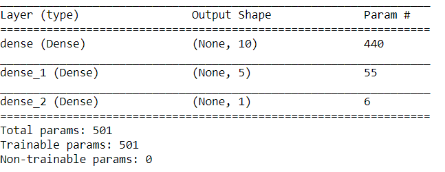
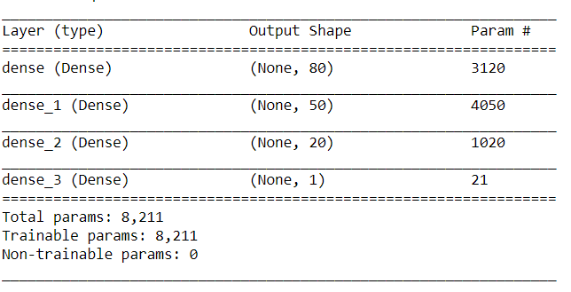

# Neural Network Charity Analysis

## Overview
Using our knowledge about neural networks and deep learning models, we created a binary classifier that is capable of predicting whether applicants will be successful if funded by Alphabet Soup.

## Results
### Data Preprocessing
**What variable(s) are considered the target(s) for your model?**  
target is 'IS_SUCCESSFUL' column  
**What variable(s) are considered to be the features for your model?**  
features are all the other columns except 'IS_SUCCESSFUL' columns and the columns we dropped ('EIN', 'NAME','STATUS')  
**What variable(s) are neither targets nor features, and should be removed from the input data?**  
Columns that don't contribute to the target or the noisy variables; in this case, they are 'EIN', 'NAME','STATUS'  
### Compiling, Training, and Evaluating the Model
**How many neurons, layers, and activation functions did you select for your neural network model, and why?**  
I started with only 2 layers (10:5 neurons) and eventually increased to 3 hidden layers(80:50:20) and 1 output layer by trial and errors.  

  
**Were you able to achieve the target model performance?**  
No  
**What steps did you take to try and increase model performance?**  
I dropped another column('STATUS), binned 'AFFLICATION' column, changed 'Classification counts', added a third hidden layer, changed the number of neurons in each layer, changed activation function from sigmoid to tanh  

## Summary
To summarize, after making multiple adjustments on the model, the highest accuracy I got is 0.63% with a loss of 0.65 which is below the required performance of 75%. /n
* recommendation: Since we only have tabular data, I would try using Ramdon forest classifier due to its robustness and scalability. Both output and feature selection of random forest models are easy to interpret, and they can easily handle outliers and nonlinear data.
